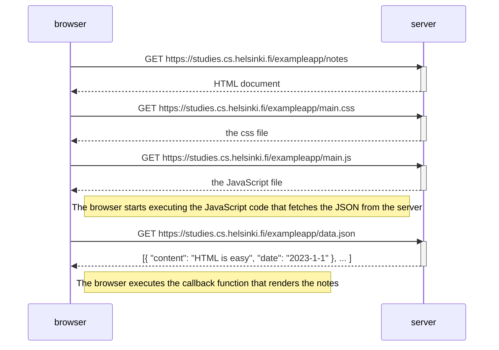
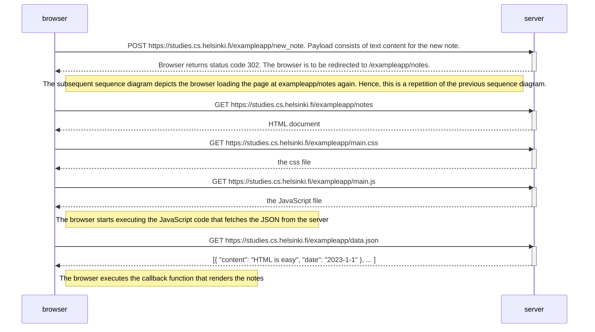

# Exercise 0

## Sample Sequence Diagram (Opening the page `https://studies.cs.helsinki.fi/exampleapp/notes`)

## 0.4: New Note Diagram 
The sequence diagram below denotes the situation where the user creates a new note on the page https://studies.cs.helsinki.fi/exampleapp/notes by writing something into the text field and clicking the submit button.

## 0.5: Simple Page App Diagram

## 0.6: New Note in Single Page App Diagram 

